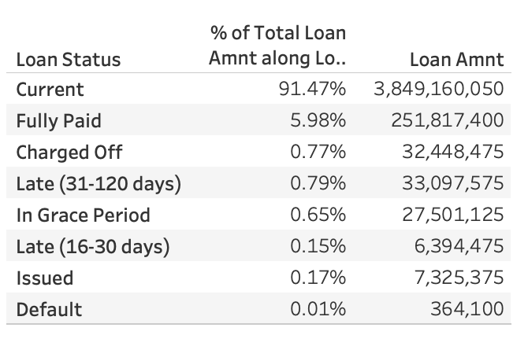
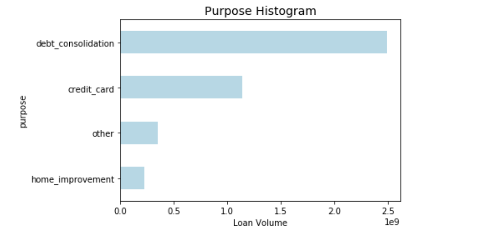
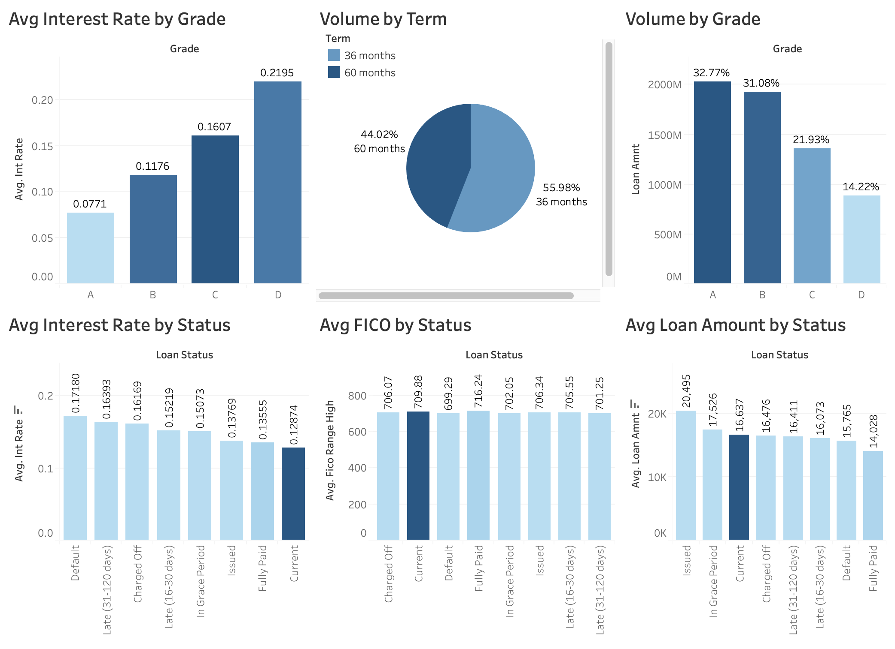
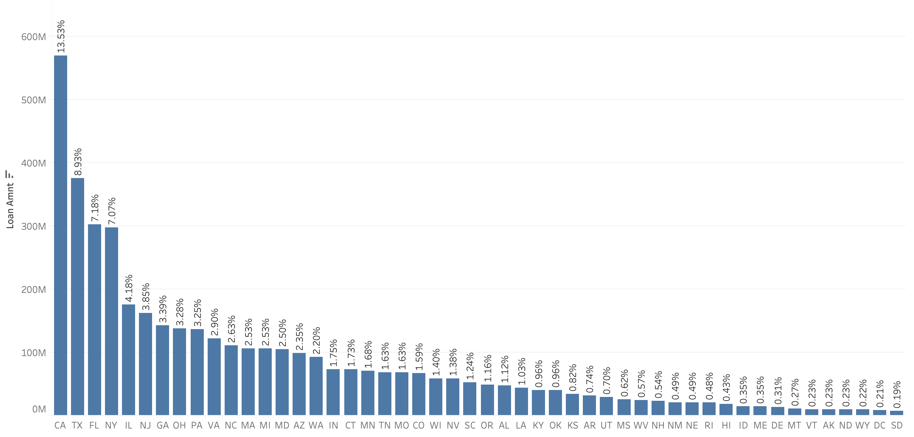
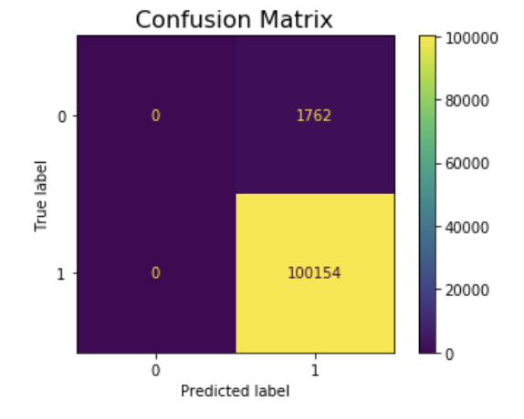
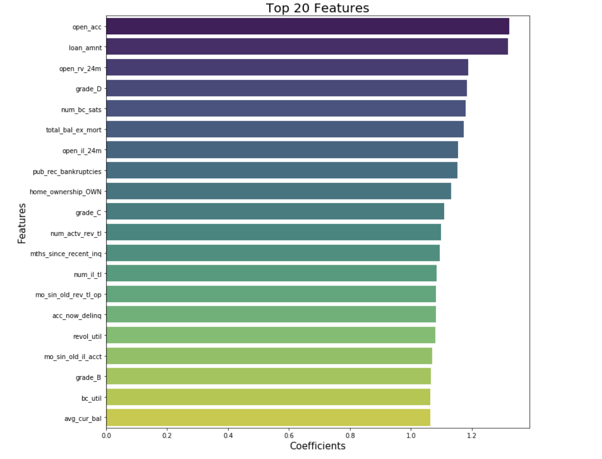

#  LendingClub: Predicting Loan Performance 

### Problem Statement

The goal of this project is to analyze the LendingClub dataset and help investors make decisions on loan applications. We want to figure out whether a loan would last and what factors, at the time a loan is issued, have the most impact on its longevity and potential to be paid off in oppose to a loan default (or charged-off). Understanding what features affect the current status of a loan would help investors make better decisions and pay closer attention to the most impactful features.

The LC Data Dictionary can be found here (LCDataDictionary.xlsx). We will deep dive into the data dictionary and review the data elements in order to identify the fields that are available to investors at the time of origination, and thus would be meaningful for our analysis and modeling.

**The goal of this project:** 
(1) Analyze the dataset, and identify the factors affecting loan performance or non-performance;
(2) Offer a model that predicts the loan default probability, and 
(3) Based on the results of our work, help investors make a decision on whether investing with LendingClub is an attractive proposition.

### Data Collection
I have pulled data directly from the LendingClub publicly available stats: [dataset](https://www.lendingclub.com/statistics/additional-statistics?) (sign in is required to obtain a complete dataset with FICO scores).

Time frame: the most recent 3 quarters 2020 Q1, 2019 Q4, and 2019 Q3. The dataset contains data for all loans issued within the past three quarters, including the current loan status (current, late, fully paid, etc.) and latest payment information. The cleaned dataset size for modeling: 254,792 rows by 79 columns.

### Exploratory Data Analysis
The EDA has uncovered a few obstacles to my analysis and modeling: 
- Significant class imbalance in certain classes: 
    - Loan Status (the target variable is hugely imbalanced, where Current + Fully Paid loans account  for 97.45 % of all loans); 
    - Volume across different states is also highly imbalanced, with the top 4 states (CA, TX, FL, NY) being 36.71% of all loan volume. The model was run with and without the State data in order to find a more pure set of the key features affecting the target.
    - Purpose is another variable, where one of 12 categories - debt_consolidation - takes up 59% of all transactions; to produce better modeling results this variable was re-categorized into 4 subgroups (instead of initial 12 subgroups), which preserves the information while reducing the skewness of the data 
- Similarities within some other classes: 
    - the average FICO score does not vary much across Loan Status groups
- Number of variables and extensive data dictionary: 
    - the loan dictionary consists of 151 loan characteristics (potential variables), of which some are not available at the time of origination and thus not meaningful for modeling; the data dictionary had to be categorized for a more systematic review
- Weak correlations: 
    - with a large number of variables, correlations to our target variable Loan Status are rather weak

To sum it up, this dataset presents a set of challenges of a real life dataset, where predicting the outcome, data cleaning and categorization, and modeling requires experimentation and effort.

    

    

Note: some charts were created with Tableau Public

### Modeling and Evaluation
1) Defining target variable for the model  
The target variable is based on the Loan Status. I've created the target variable using the following logic: 
Good loans = Current + Fully Paid + In Grace Period + Issues  
Bad loans = Charged off + Default + Late (16-30 days) + Late (31-120 days) 
Good loans/Current status = 1 
Bad loans/Defaulting and Lates = 0 

2) Selecting and Evaluating a model  
Our goal is to predict whether a loan would perform or not. For this type of a binary outcome, **Logistic Regression** is a suitable model. Another fitting model is **Random Forest**. I've run both models, and both produced similar accuracy scores. Because of the high percentage of current loans, our baseline is high at 0.98282. The Logistic Regression had an accurate score of 0.98271, and Random Forest 0.98290, only slightly beating the baseline. Confusion Matrix reflects a False Positive rate of 1.72%.

3) Identifying top features affecting the target variable
Another reason the Logistic Regression is a very suitable model for this project, is because this model produces a set of coefficients, which show how strongly each X variable affects the target variable. The model was run with and without the State data, in order to obtain a more pure set of top features. While State data is important, the percentage of non-current loans by State follows the pattern of State data for all loans (due to skewness of State volume, and concentration of transactions in the top 4 states). And due to incredibly small percentage of loans within low-volume states, and a significant portion of loans being current (which is true across the board), the model has identified the lowest volume states as advantageous for maintaining current/good loan status. However, this is truly misleading and this would certainly change if we assume a higher volume within those same states. Thus, it appears logical to remove the States from the model and attempt to produce a more pure result based solely on borrower and loan characteristics. The top 20 features affecting the loan performance are shown in the graph below. 

*Legend for the top 10 most significant features:* 
open_acc - The number of open credit lines in the borrower's credit file  
Loan_amnt - Loan amount 
Open_rv_24m - Number of revolving trades opened in past 24 months 
Grade - LC assigned loan grade 
num_bc_sats - Number of satisfactory bankcard accounts 
total_bal_ex_mort - Total credit balance excluding mortgage 
open_il_24m - Number of installment accounts opened in past 24 months 
pub_red_bankruptcies - Number of public record bankruptcies 
home_ownership - The home ownership status provided by the borrower during registration or obtained from the credit report  
num_actv_rev_tl - Number of currently active revolving trades 

### Conclusion and Recommendations:
This project has identified the main drivers of loan performance. We've achieved a fairly high accuracy score, though ideally it would be desirable to beat the baseline with somewhat higher margin. Because this model can predict a good/bad loan performance with 98.29% accuracy, an investor making a loan decision can better understand the expected risk and the key factors impacting a healthy loan performance. This, combined with an additional diversification features (an investor can spread out their money across multiple loans (the min amount per note is 25 dollars) within LendingClub, helps investors further diversify the risk. An individual looking to step into the shoes of an investor with LendingClub can use this model to help evaluate their decision. 

Next steps for project improvement: 
- Proceed with additional modelling to attempt to achieve an even higher accuracy, beating 98.29% and getting closer to 100%
- Pulling a larger dataset to get a deeper look at the key features and the model
